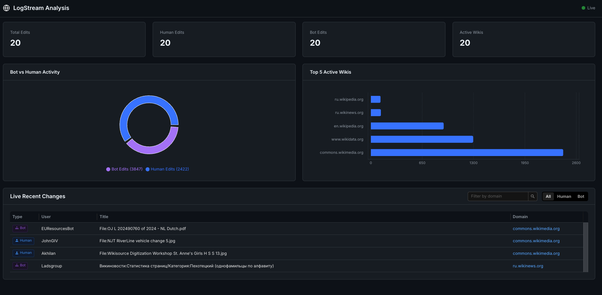
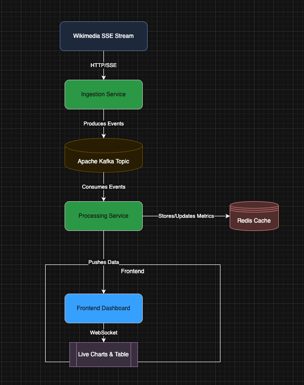
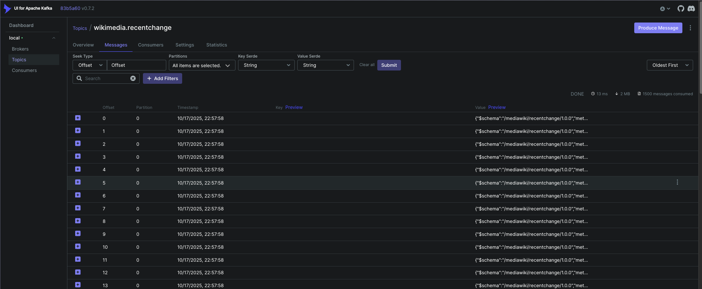

# LogStream-Analytics: Real-Time Wikimedia Monitoring Dashboard

LogStream-Analytics is a full-stack, real-time data analytics platform designed to ingest, process, and visualize
high-throughput data streams. This implementation monitors the live recent changes feed from all Wikimedia projects (
like Wikipedia), providing instant insights into global edit activity.

The project demonstrates a modern, cloud-native architecture using microservices, a distributed messaging queue,
in-memory caching, and WebSockets for a dynamic frontend experience.



# 🏛️ Architecture Overview

The platform is composed of three core microservices that form a unidirectional data pipeline:

- **Ingestion Service**: A non-blocking Spring WebFlux service that connects to the Wikimedia Server-Sent Events (SSE)
  stream. It reads the raw event data and immediately publishes it to a Kafka topic without processing.
- **Processing Service**: A Spring Boot service that consumes the raw data from Kafka. It parses each message,
  calculates aggregate metrics in real-time (e.g., total edits, bot vs. human activity, top wikis), and stores these
  metrics in a Redis cache for fast lookups. It then broadcasts both the raw event and the aggregated metrics to the
  frontend via a WebSocket connection.
- **Frontend Dashboard**: A React single-page application built with TypeScript and styled with SCSS and Ant Design. It
  establishes a WebSocket connection to the Processing Service to receive and display the log data and metrics in
  real-time, using charts and a filterable table.

# DataFlow




# TechStack
- **Backend** - Java 17, Spring Boot, Spring WebFlux (Reactive)
- **Frontend** - React.js, TypeScript, SCSS, Ant Design, Recharts
- **Messaging Queue** - Apache Kafka
- **In-memory Cache** - Redis
- **Communication** - WebSockets (with STOMP)
- **Build Tools** - Maven (Backend), Vite (Frontend)

# 📂 Project Structure
```
├── data-ingestion-service/      # Connects to Wikimedia and pushes to Kafka
├── data-processing-service/     # Consumes from Kafka, processes, and pushes to frontend
├── react-dashboard/  # React frontend application
└── README.md               # This file
```